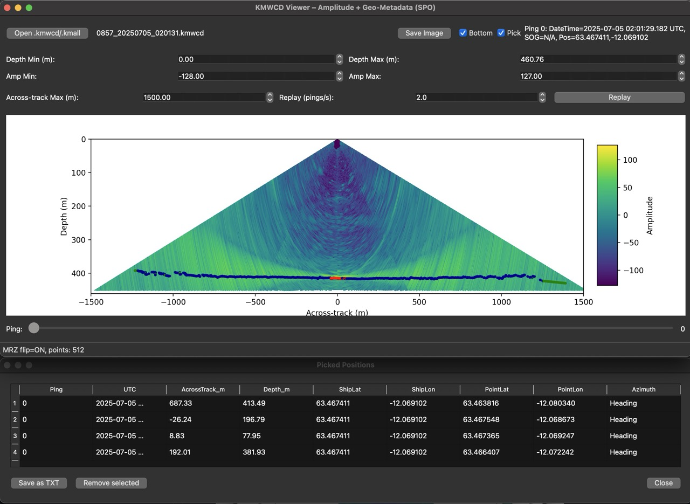

# KMWCD Viewer

**Current Version:** kmwcd_viewer_v0.7.8.py  
**Scope:** Raw amplitude plotting (no dB), navigation metadata from `#SPO`, static X-scale option, image export, progress feedback, display bottom detections, data replay and geo-picking.

This tool was created using [valschmidt](https://github.com/valschmidt) work and his [KMALL file reader](https://github.com/valschmidt/kmall), and was heavily influenced the [KMWCD Viewer for EM2040](https://github.com/ReeceClark2/kmwcd-viewer) from [ReeceClark2](https://github.com/ReeceClark2).

The tool reads the water column data and navigation directly from KMWCD/KMALL files. No conversion and/or importing are required.




---

## 1. Overview

The KMWCD Viewer loads `.kmwcd`/`.kmall` files, parses their datagrams via your local `kmall.py`, and renders water-column amplitude as a 2D color image (samples × beams). It also reads `#SPO` (sensor position) datagrams to show nearest-in-time vessel metadata (UTC time, speed over ground, latitude, longitude).

The tool is built with **PySide6** (Qt6 for Python) for the UI and **matplotlib** for plotting. It features:
- Depth windowing (min/max)
- Amplitude range control (min/max)
- **Static across-track X-scale** (symmetric limits) so the plot doesn't jump across pings
- One-step mouse wheel, slider, and left/right arrow navigation
- Export to PNG/JPEG at **2× resolution** with filename + meta overlay
- Status-bar **loading percentage** during pre-scan of the file Shows per‑ping "MRZ points: <n>" and a startup blip like "Nav summary: MRZ=<m>, SKM=<k>, SPO=<s>".
- Bottom detections by type (Amplitude/Phase) and class (Normal/Extra)
- **Replay** (0.1–10 pings/s) with the slider kept in sync
- **Pick** mode with a modeless **Picked Positions** dialog (save to `.txt`)
- Lightweight diagnostic prints to the terminal (kept intentionally)

---

## 2. Data Flow & Key Structures

1. **Open file** → `KMALL.kmall(path)` then `loader.index_file()` builds a pandas `Index` DataFrame listing all datagrams (types, offsets, timestamps).  
2. **Filter pings**: robust detection of `#MWC` (handles string/bytes/substring representations).  
3. **Collect NAV**: read all `#SPO` records; each yields `sensorData` with `datetime`, `correctedLat_deg`, `correctedLong_deg`, `speedOverGround_mPerSec`. We store them in a time-indexed DataFrame for nearest-time lookup.  
4. **Pre-scan (progress)**: iterate pings once to compute file-wide:
   - `amp_min`, `amp_max` from raw amplitude
   - `depth_max` from computed depth grid
   - `across_max` from max `|across-track|` grid
   While scanning, update status bar with `Loading pings… XX%`.
5. **Render ping**: for the selected ping
   - `beamData.sampleAmplitude05dB_p` → amplitude array (no dB conversion)
   - `beamPointAngReVertical_deg` → per-beam angles
   - `range[m] = sample_index * 0.5 * soundVelocity / sampleFreq`
   - `depth Z = -cos(angle) * range`, `across-track Y = sin(angle) * range`
   - Mask depths outside `[dmin, dmax]`
   - Plot using `pcolormesh(Y, Z, A)` with `vmin=amp_min`, `vmax=amp_max`
   - Set **X limits** to `[-Xmax, Xmax]` if Xmax > 0; else autoscale
   - Invert Y so depth grows downward
6. **Metadata line**: find nearest `#SPO` to ping time using `DatetimeIndex.get_indexer(..., method='nearest')` and format time, SOG, lat, lon.

---

## 3. UI Architecture

- **MainWindow (QMainWindow)**  
  - Header row:  
    - *Open* (QPushButton)
    - *Save Image* (QPushButton)
    - *Filename* (QLabel)
    - *Metadata* (QLabel; time/SOG/lat/lon)
  - Controls:  
    - Depth Min/Max (QDoubleSpinBox)  
    - Amp Min/Max (QDoubleSpinBox)  
    - **Across-track Max (m)** (QDoubleSpinBox)  
  - Plot area: Matplotlib FigureCanvas with a fixed-position colorbar Axes (`self.cax`) to avoid re-layout creep.  
  - Ping slider row: *Ping:* label, slider (one-step wheel), current ping label.  
  - Status bar: shows **loading %** during pre-scan.

- **Keyboard & Wheel**  
  - Left/Right arrows move one ping.  
  - Mouse wheel: one ping per notch (custom QSlider).

- **Picked Positions**: modeless dialog sized to the main window’s width and ~one‑third height. Closing it **clears all picks** and unchecks **Pick** in the main window.

- **Status bar**: shows file name, ping number, UTC time, SOG (see note below), and MRZ points count.

---

## 4. Plotting & Color Scaling

- **Raw amplitude**: The viewer plots raw amplitude values directly (no dB).  
- **Normalization**: Linear normalization controlled by *Amp Min* / *Amp Max*. No per-ping auto unless you set those controls.  
- **Geometry**: `Y=sin(angle)*range` (across-track), `Z=-cos(angle)*range` (depth).  
- **Static X-scale**: If *Across-track Max* is set, use symmetric `[-Xmax, Xmax]` to stop jitter between pings.
- **Bottom (MRZ) overlay**:
  - Always **flipped** so that the across‑track sign matches the water‑column plot.
  - **Color by detectionMethod** (from MRZ):
    - `1` = **Amplitude** → Red
    - `2` = **Phase** → Dark Blue
  - **Fill by detectionType** (from MRZ):
    - `0` = **Normal** → **solid** markers
    - `1` = **Extra** → **hollow** markers
    - `2` = **Rejected** → currently drawn in **green** (hollow)

---

## 5. Picking & Export

Enable **Pick**, then click in the plot. Each click appends a row to *Picked Positions* with:

- `Ping` (index), `UTC`
- `AcrossTrack_m` (signed), `Depth_m`
- `ShipLat`, `ShipLon` (from nav at ping time)
- `PointLat`, `PointLon` (computed by across‑track offset using COG/Heading when available)
- `Azimuth` (**COG** preferred; **Heading** used when available)

Use **Save** to export a tab‑separated `.txt`. **Close** clears all rows and disables Pick.

---

---

## 6. Design Decisions

- **Fixed colorbar axes**: avoids the colorbar pushing the plot left on every redraw.  
- **Nearest-time NAV lookup**: robust against small timing offsets between ping and `#SPO` timestamps.  
- **Pre-scan with progress**: preserves interactivity later (no surprises when ranges change mid-session).  
- **Sanitizing arrays**: `fill_nonfinite_cols` handles columns of NaN/inf for stable `pcolormesh`.

---

## 7. Caveats & Limits

- **No `#SPO` → N/A metadata**: If a file lacks `#SPO`, SOG/lat/lon remain `N/A`.  
- **Large files**: Pre-scan touches all pings once; on very large files this can take some time (status shows %).  
- **Amplitude units**: raw units from the driver (may not be absolute calibrated dB).  
- **Angles**: relies on `beamPointAngReVertical_deg` being present/valid; missing/NaN are forward/back-filled safely.
- **Dual Swath & Coverage**: acrosstrack range is dynamic and affected by the data. If swath width appears to jump, set the acrosstrack max distance, and plotting will then remain static and based on the max value.

---

## 8. Dependencies

- **Python** ≥ 3.11 (3.13 recommended)  
- **PySide6** (Qt6 for Python)  
- **matplotlib**  
- **numpy**  
- **pandas**  
- **kmall.py** (your KMALL reader; importable as `KMALL`)  

Optional: If your `kmall.py` is named differently or lives elsewhere, ensure `sys.path` includes its folder or adjust the import (`import kmall as KMALL`).

---

## 8. Files of Interest

- `kmwcd_viewer.py` – main viewer.  
- `kmall.py` – local KMALL driver (required).

---

## 9. Extension Ideas

- **dB mode** with per-file or per-ping auto-scaling.  
- **Interpolation** mode with `scipy.interpolate.griddata` (cubic), saved as a secondary render mode.  
- **QProgressBar** in the status bar, in addition to % text.  
- **Export presets** (color map selection, DPI multiplier, caption layout).

---

## 10. Testing Notes

- Confirmed robust `#MWC/#SPO` filtering for string/bytes formats.  
- Verified colorbar remains fixed across UI actions.  
- Confirmed keyboard and one-step wheel navigation.  
- Verified export includes filename + metadata and honors 2× DPI.

## 11. Planned Features

- Add capability of opening a list of files (datalist) or directory.
- Add a stacked view (alongtrack). 
- Add support to more WCD formats (WCD/ALL, S7K, R2Sonics, etc).
- Integrate the tool in MB-System, and use MB I/O drivers to read the data (including KMALL).

## 12. Possible Features

- Add filters to remove noise from data.
- Add possibility to detect and export features.
- A C++ version for better performance.
- Add a small window showing the navigation and/or bathymetry and where we are.
- Maybe integrate it in MBeditviz or MBgrdviz?

# KMWCD Viewer – Installation Guide

This guide covers **macOS 15 (Sequoia)** via **MacPorts**, **Ubuntu 24.04 LTS** and **Windows10/11**.

## Prerequisites

- A local copy of:
  - `kmwcd_viewer.py` (the viewer script)
  - `kmall.py` (your KMALL reader)
- Python 3.11+ (3.13 recommended)

---

## macOS 15 (Sequoia) – Using MacPorts

### Option A: System Python + MacPorts packages

1. Install required ports:
   ```bash
   sudo port selfupdate
   sudo port install python313 py313-pip py313-pyside6 py313-matplotlib py313-numpy py313-pandas py313-pyproj py313-scipy
   ```

2. (Optional) Select python/pip defaults:
   ```bash
   sudo port select --set python python311
   sudo port select --set pip pip313
   ```

3. Run the viewer:
   ```bash
   cd /path/to/your/folder
   python3.13 kmwcd_viewer.py
   ```

### Option B: Virtual environment

1. Install Python and pip via MacPorts (if not already):
   ```bash
   sudo port install python313 py313-pip
   ```

2. Create and activate venv:
   ```bash
   python3.13 -m venv .venv
   source .venv/bin/activate
   ```

3. Install packages from PyPI:
   ```bash
   pip install --upgrade pip
   pip install PySide6 matplotlib numpy pandas pyproj scipy
   ```

4. Run the viewer:
   ```bash
   python kmwcd_viewer.py
   ```

> Ensure `kmall.py` is in the same directory or on `PYTHONPATH`. If your KMALL module is named `kmall.py`, the script expects it importable as `KMALL` (you can rename import to `import kmall as KMALL` if needed).

---

## Ubuntu 24.04 LTS

### Option A: Virtual environment (recommended)

1. Install base packages:
   ```bash
   sudo apt update
   sudo apt install -y python3 python3-venv python3-pip build-essential
   ```

2. Create and activate venv:
   ```bash
   python3 -m venv .venv
   source .venv/bin/activate
   ```

3. Install Python dependencies:
   ```bash
   pip install --upgrade pip
   pip install PySide6 matplotlib numpy pandas pyproj scipy
   ```

4. Run the viewer:
   ```bash
   python kmwcd_viewer.py
   ```

---

## Tips & Troubleshooting

- **Import path**: Keep `kmall.py` next to the viewer. The script adds its folder to `sys.path` to help import `KMALL`.
- **Missing `#SPO`**: SOG/lat/lon will display as `N/A` if your file doesn’t carry `#SPO` datagrams.
- **Colorbar creep**: The viewer uses a fixed colorbar axes; if it ever shifts, ensure you’re on the latest version.
- **Static X-scale**: Set “Across-track Max (m)” to a positive value to lock X; set to 0 for autoscale.

---

## Windows 10/11


### 1) Install Python 3 (64‑bit)

1. Go to https://www.python.org/downloads/windows/ and download **Python 3.x (64‑bit)**.
2. Run the installer and **check “Add Python to PATH.”**
3. After install, open **PowerShell** and verify:
   ```powershell
   python --version
   pip --version
   ```

> If PowerShell blocks script execution when activating virtualenvs, you can temporarily allow it for the current shell:
> ```powershell
> Set-ExecutionPolicy -Scope Process -ExecutionPolicy Bypass
> ```

---

### 2) Create a project folder and a virtual environment

```powershell
# Create a working folder (adjust path as desired)
mkdir C:\KMWCD
cd C:\KMWCD

# Copy your files into this folder
# - kmwcd_viewer.py
# - kmall.py

# Create and activate a virtual environment
python -m venv .venv
.\.venv\Scripts\Activate.ps1

# Upgrade pip
python -m pip install --upgrade pip
```

---

### 3) Install Python dependencies

```powershell
pip install PySide6 matplotlib numpy pandas proj scipy
```

**Verify**:
```powershell
python - << 'PY'
import PySide6, matplotlib, numpy, pandas
print("OK: PySide6", PySide6.__version__, "| matplotlib", matplotlib.__version__)
PY
```

---

### 4) Run the viewer

```powershell
python .\kmwcd_viewer.py
```

- Use **Open** to load a `.kmwcd`/`.kmall` file.
- You should see:
  - Depth & amplitude controls, **Across‑track Max (m)** to lock X scale
  - Ping slider with **Left/Right** keys and **1‑step mouse wheel**
  - Metadata line from **#SPO** (UTC time, SOG, latitude, longitude)
  - **Save Image** for PNG/JPEG at **2× DPI** with filename + meta overlay
  - Status bar shows **Loading pings… XX%** during pre‑scan

---

### 5) Make a convenient launcher (optional)

Create a file `run_viewer.bat` in `C:\KMWCD`:

```bat
@echo off
setlocal
call .\.venv\Scripts\activate.bat
python kmwcd_viewer.py
```

Double‑click `run_viewer.bat` to start the app next time.

---

### 6) Package as a standalone EXE (optional)

You can bundle the app with **PyInstaller**:

```powershell
pip install pyinstaller
pyinstaller --noconfirm --windowed --onefile ^
  --name KMWCDViewer ^
  --collect-submodules PySide6 --collect-data PySide6 ^
  --collect-data matplotlib ^
  --add-data "kmall.py;." ^
  kmwcd_viewer.py
```

- The EXE will be in `dist\KMWCDViewer.exe`.
- Ship it together with your test `.kmwcd` files.
- If your **KMALL driver** reads auxiliary files, add them via extra `--add-data` lines.

---

### 7) Troubleshooting

- **“DLL not found” or Qt errors**  
  Install **Microsoft Visual C++ Redistributable (x64)** (2015–2022).  
  https://learn.microsoft.com/cpp/windows/latest-supported-vc-redist

- **Black/blank window or OpenGL issues**  
  Force software rendering (rare on Widgets apps):
  ```powershell
  setx QT_OPENGL software
  ```

- **ImportError: cannot import KMALL**  
  Ensure `kmall.py` is in the **same folder** as the viewer script, or add its folder to `PYTHONPATH`.

- **Activation blocked**  
  Temporarily bypass execution policy:
  ```powershell
  Set-ExecutionPolicy -Scope Process -ExecutionPolicy Bypass
  ```

---

### 8) Files checklist

- `kmwcd_viewer.py` (or your latest)
- `kmall.py` (your KMALL reader)
- Optional: `run_viewer.bat` launcher

That’s it! If you want an **MSI installer** later, we can generate one from the PyInstaller build using tools like `wixl` or `msi-packager`.